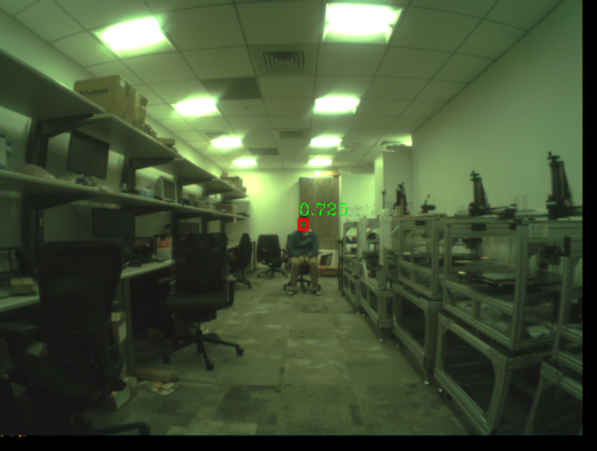

# Code for Face Detection Experiments with RNNPool
Refer to README_M4.md for instructions related to the M4 model
## Requirements
1. Follow instructions to install EdgeML operators and their pre-requisites [here](https://github.com/microsoft/EdgeML/blob/master/pytorch/README.md).
2. Install requirements for face detection model using
``` pip install -r requirements.txt ``` 
We have tested the installation and the code on Ubuntu 18.04 with Python 3.6, Cuda 10.2 and CuDNN 7.6

## Dataset
1. Download WIDER face dataset images and annotations from http://shuoyang1213.me/WIDERFACE/ and place them all in a folder with name 'WIDER_FACE'. That is, download WIDER_train.zip, WIDER_test.zip, WIDER_val.zip, wider_face_split.zip and place it in WIDER_FACE folder, and unzip files using: 

```shell
cd WIDER_FACE
unzip WIDER_train.zip
unzip WIDER_test.zip
unzip WIDER_val.zip
unzip wider_face_split.zip
cd ..

```

2. Set environment variable DATA_HOME to the parent directory of the above folder
That is, if the WIDER_FACE folder is created in /mnt folder

``` export DATA_HOME='/mnt' ```

Note that for Windows '/' should be replaced by '\'.
For all following commands the environment variable IS_QVGA_MONO has to be set as 0 for using config.py (to use RGB 640x480 images) and as 1 for using config_qvga.py (to use monochrome 320x240 images) as the configuration file.


3. Run
``` IS_QVGA_MONO=1 python prepare_wider_data.py ```


# Usage

## Training

```shell

IS_QVGA_MONO=0 python train.py --batch_size 32 --model_arch RPool_Face_Quant --cuda True --multigpu True --save_folder weights/ --epochs 300 --save_frequency 5000 

```

For QVGA:
```shell

IS_QVGA_MONO=1 python train.py --batch_size 64 --model_arch RPool_Face_QVGA_monochrome --cuda True --multigpu True --save_folder weights/ --epochs 300 --save_frequency 5000 

```
This will save checkpoints after every '--save_frequency' number of iterations in a weight file with 'checkpoint.pth' at the end and weights for the best state in a file with 'best_state.pth' at the end. These will be saved in '--save_folder'. For resuming training from a checkpoint, use '--resume <checkpoint_name>.pth' with the above command. For example, 


```shell

IS_QVGA_MONO=1 python train.py --batch_size 64 --model_arch RPool_Face_QVGA_monochrome --cuda True --multigpu True --save_folder weights/ --epochs 300 --save_frequency 5000 --resume <checkpoint_name>.pth

```

If IS_QVGA_MONO is 0 then training input images will be 640x640 and RGB. 
If IS_QVGA_MONO is 1 then training input images will be 320x320 and converted to monochrome. 

Input images for training models are cropped and reshaped to square to maintain consistency with [S3FD](https://arxiv.org/abs/1708.05237). However testing can be done on any size of images, thus we resize testing input image size to have area equal to VGA (640x480)/QVGA (320x240), so that aspect ratio is not changed.

The architecture RPool_Face_QVGA_monochrome is for QVGA monochrome format while RPool_Face_C and RPool_Face_Quant are for VGA RGB format.


## Test
There are two modes of testing the trained model -- the evaluation mode to generate bounding boxes for a set of sample images, and the test mode to compute statistics like mAP scores.

#### Evaluation Mode

Given a set of images in <your_image_folder>, `eval/py` generates bounding boxes around faces (where the confidence is higher than certain threshold) and write the images in <your_save_folder>. Specify if the model was trained in multigpu setting in --multigpu. To evaluate the `rpool_face_best_state.pth` model (stored in ./weights), execute the following command: 

```shell
IS_QVGA_MONO=0 python eval.py --model_arch RPool_Face_Quant --model ./weights/RPool_Face_Quant_best_state.pth --image_folder <your_image_folder> --save_dir <your_save_folder> --multigpu True
```

For QVGA:
```shell
IS_QVGA_MONO=1 python eval.py --model_arch RPool_Face_QVGA_monochrome --model ./weights/RPool_Face_QVGA_monochrome_best_state.pth --image_folder <your_image_folder> --save_dir <your_save_folder> --multigpu True
```

This will save images in <your_save_folder> with bounding boxes around faces, where the confidence is high. Here is an example image with a single bounding box.



If IS_QVGA_MONO=0 the evaluation code accepts an image of any size and resizes it to 640x480x3 while preserving original image aspect ratio.

If IS_QVGA_MONO=1 the evaluation code accepts an image of any size and resizes and converts it to monochrome to make it 320x240x1 while preserving original image aspect ratio.

#### WIDER Set Test
In this mode, we test the generated model against the provided WIDER_FACE validation and test dataset. 

For this, first run the following to generate predictions of the model and store output in the '--save_folder' folder. Specify if the model was trained in multigpu setting in --multigpu.

```shell
IS_QVGA_MONO=0 python wider_test.py --model_arch RPool_Face_Quant --model ./weights/RPool_Face_Quant_best_state.pth --save_folder rpool_face_quant_val --subset val --multigpu True
```

For QVGA:
```shell
IS_QVGA_MONO=1 python wider_test.py --model_arch RPool_Face_QVGA_monochrome --model ./weights/RPool_Face_QVGA_monochrome_best_state.pth --save_folder rpool_face_qvgamono_val --subset val --multigpu True
```

The above command generates predictions for each image in the "validation" dataset. For each image, a separate prediction file is provided (image_name.txt file in appropriate folder). The first line of the prediction file contains the total number of boxes identified. 
Then each line in the file corresponds to an identified box. For each box, five numbers are generated: length of the box, height of the box, x-axis offset, y-axis offset, confidence value for presence of a face in the box. 

If IS_QVGA_MONO=1 then testing is done by converting images to monochrome and QVGA, else if IS_QVGA_MONO=0 then testing is done on VGA RGB images.

The architecture RPool_Face_QVGA_monochrome is for QVGA monochrome format while RPool_Face_C and RPool_Face_Quant are for VGA RGB format.

###### For calculating mAP scores:
Now using these boxes, we can compute the standard mAP score that is widely used in this literature (see [here](https://medium.com/@jonathan_hui/map-mean-average-precision-for-object-detection-45c121a31173) for more details) as follows:

1. Download eval_tools.zip from http://shuoyang1213.me/WIDERFACE/support/eval_script/eval_tools.zip and unzip in a folder of same name in this directory.

Example code: 

```shell
wget http://shuoyang1213.me/WIDERFACE/support/eval_script/eval_tools.zip 
unzip eval_tools.zip
```

2. Set up scripts to use the Matlab '.mat' data files in eval_tools/ground_truth folder for mAP calculation: The following installs python files that provide the same functionality as the '.m' matlab scripts in eval_tools folder.
``` 
cd eval_tools
git clone https://github.com/wondervictor/WiderFace-Evaluation.git
cd WiderFace-Evaluation 
python3 setup.py build_ext --inplace
```

3. Run ```python3 evaluation.py -p <your_save_folder> -g <groud truth dir>``` in WiderFace-Evaluation folder

where `-p` is the '--save_folder' used for `wider_test.py` above and <groud truth dir> is the subfolder `eval_tools/ground_truth`. That is in, WiderFace-Evaluation directory, run: 

```shell
python3 evaluation.py -p ../../rpool_face_qvgamono_val -g ../ground_truth
```
This script should output the mAP for the WIDER-easy, WIDER-medium, and WIDER-hard subsets of the dataset. Our best performance using RPool_Face_Quant model is: 0.80 (WIDER-easy), 0.78 (WIDER-medium), 0.53 (WIDER-hard). 


##### Dump RNNPool Input Output Traces and Weights

For saving model weights and/or input output pairs for each patch through RNNPool in numpy format use the command below. Put images which you want to save traces for in <your_image_folder> . Specify output folder for saving model weights in numpy format in <your_save_model_numpy_folder>. Specify output folder for saving input output traces of RNNPool in numpy format in <your_save_traces_numpy_folder>. Note that input traces will be saved in a folder named 'inputs' and output traces in a folder named 'outputs' inside <your_save_traces_numpy_folder>.

```shell
python3 dump_model.py --model ./weights/RPool_Face_QVGA_monochrome_best_state.pth --model_arch RPool_Face_Quant --image_folder <your_image_folder> --save_model_npy_dir <your_save_model_numpy_folder> --save_traces_npy_dir <your_save_traces_numpy_folder>
```
If you wish to save only model weights, do not specify --save_traces_npy_dir. If you wish to save only traces do not specify --save_model_npy_dir.

Code has been built upon https://github.com/yxlijun/S3FD.pytorch