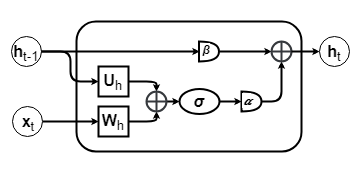
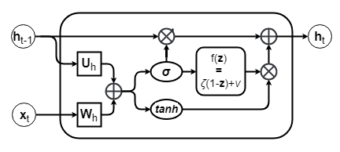
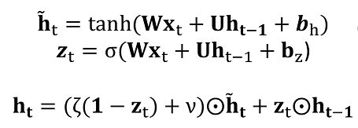

# FastRNN and FastGRNN - FastCells

This document aims to explain and elaborate on specific details of FastCells 
present as part of `tf/edgeml/graph/rnn.py`. The endpoint use case scripts with 
3 phase training along with an example notebook are present in `tf/examples/FastCells/`.
One can use the endpoint script to test out the RNN architectures on any dataset 
while specifying budget constraints as part of hyper-parameters in terms of sparsity and rank 
of weight matrices.

# FastRNN

# FastGRNN

# Plug and Play Cells

`FastRNNCell` and `FastGRNNCell` present in `edgeml.graph.rnn` are very similar to 
Tensorflow's inbuilt `RNNCell`, `GRUCell`, `BasicLSTMCell`, and `UGRNNCell` allowing us to 
replace any of the standard RNN Cell in our architecture with FastCells. 
One can see the plug and play nature at the endpoint script for FastCells, where the graph 
building is very similar to LSTM/GRU in Tensorflow. 

Script: [Endpoint Script](../examples/FastCells/fastcell_example.py)

Example Notebook: [iPython Notebook](../examples/FastCells/fastcell_example.ipynb)

Cells: [FastRNNCell](../edgeml/graph/rnn.py#L206) and [FastGRNNCell](../edgeml/graph/rnn.py#L31).

# 3 phase Fast Training

`FastCells`, similar to `Bonsai` use a 3 phase training routine, to induce the right 
support and sparsity for the weight matrices. With the low-rank parameterization of weights 
followed by the 3 phase training, we obtain FastRNN and FastGRNN models which are compact 
and they can be further compressed by using byte quantization without significant loss in accuracy.

# Compression

1) Low-Rank Parameterization of Weight Matrices (L)
2) Sparsity (S)
3) Quantization (Q)

Low-rank is directly induced into the FastCells during initialization and the training happens with 
the targetted low-rank versions of the weight matrices. One can use `wRank` and `uRank` parameters 
of FastCells to achieve this.

Sparsity is taken in as hyper-parameter during the 3 phase training into `fastTrainer.py` which at the 
end spits out a sparse, low-rank model.

Further compression is achieved by byte Quantization and can be performed using `quantizeFastModels.py` 
script which is part of `tf/exampled/FastCells/`. This will give model size reduction of up to 4x if 8-bit
integers are used. Lastly, to facilitate all integer arithmetic, including the non-linearities, one could 
use `quantTanh` instead of `tanh` and `quantSigm` instead of `sigmoid` as the non-linearities in the RNN 
Cells followed by byte quantization. These non-linearities can be set using the appropriate parameters in 
the `FastRNNCell` and `FastGRNNCell`
